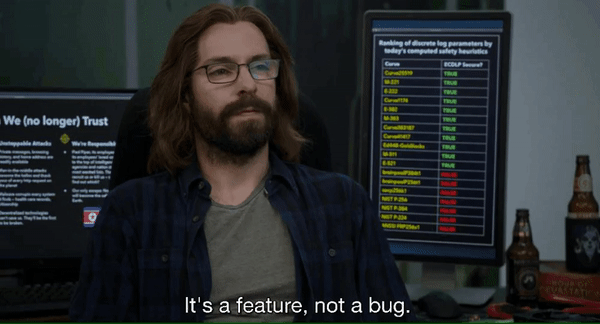

Hazırda programlaşdırma üzrə öyrənirəm <strong><a href="https://samilhuseynov.com/">@Samilhuseynov</a></strong>. Bəzi yan layihələrdə işləyirəm, bir neçə yeni şeylər öyrənirəm.

   

<h2>⚡️ Bir neçə sürətli fakt</h2>
<ul>
<li>🔭Hazırda <strong> PDF Bot üzərində işləyirəm.</strong></li>
<li>🌱 Python </strong> da async </strong>, <strong> golang </strong> haqqında məlumat.</li>
<li>💬 Məndən <strong> Telegram və Python </strong> barədə soruşun.</li>
<li>👨‍💻 <strong> Layihələrimin </strong> əksəriyyəti <a href="https://github.com/texnocom">Github</a>'da mövcuddur </li> 
<li>🦹 Sevimli super cani <a href="https://en.wikipedia.org/wiki/Eobard_Thawne"><strong>Reverse-Flash</strong></a>.</li>
<li>⚡ Əyləncəli fakt: Çox <strong>Qəhvə içirəm☕</strong>.</li>
</ul>
<h2>🚀 İstifadə etdiyim bəzi alətlər</h2>

